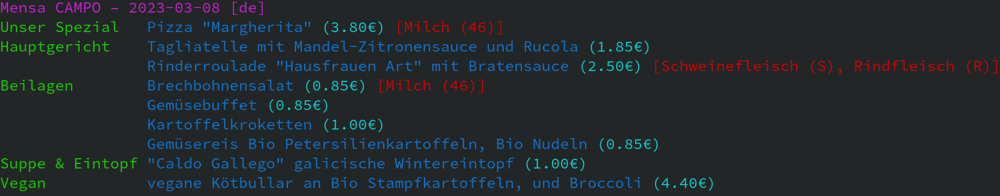

# Meal plans for university canteens in Bonn

A python script for displaying the meal plans of the canteens of the [Studierendenwerk Bonn](https://www.studierendenwerk-bonn.de/).
The script parses the HTML response of a call to an API.
Depending on your request the API might take a few seconds to respond.





## Installation

To install this script, run
```sh
$ pip install git+https://github.com/felixblanke/bonn-mensa.git
```

## Usage

To run the script, simply run `mensa`. For a list of all arguments, see `mensa --help`
```
$ mensa --help
usage: mensa [-h] [--vegan | --vegetarian]
             [--mensa {SanktAugustin,CAMPO,Hofgarten,FoodtruckRheinbach,VenusbergBistro,CasinoZEF/ZEI,Foodtruck}]
             [--filter-categories [CATEGORY ...]] [--date DATE] [--lang {de,en}] [--show-all-allergens]
             [--show-additives]

options:
  -h, --help            show this help message and exit
  --vegan               Only show vegan options
  --vegetarian          Only show vegetarian options
  --mensa {SanktAugustin,CAMPO,Hofgarten,FoodtruckRheinbach,VenusbergBistro,CasinoZEF/ZEI,Foodtruck}
                        The canteen to query. Defaults to CAMPO.
  --filter-categories [CATEGORY ...]
                        Meal categories to hide. Defaults to ['Buffet', 'Dessert'].
  --date DATE           The date to query for in YYYY-MM-DD format. Defaults to today.
  --lang {de,en}        The language of the meal plan to query. Defaults to German.
  --show-all-allergens  Show all allergens. By default, only allergens relevant to vegans (e.g. milk or fish) are shown.
  --show-additives      Show additives.
```
